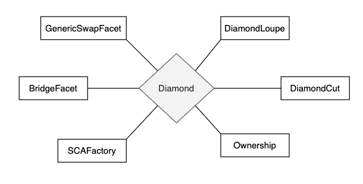
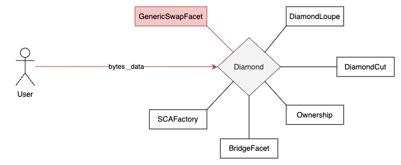
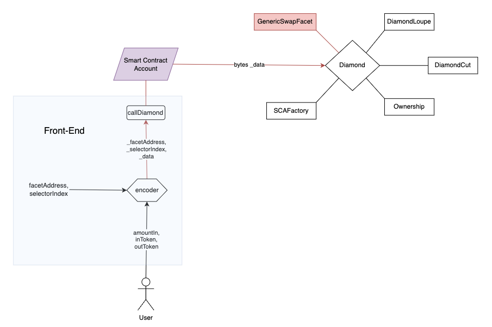
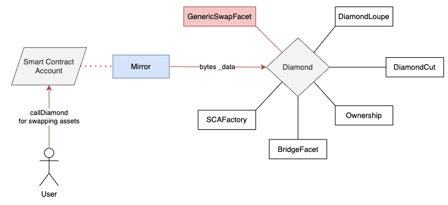
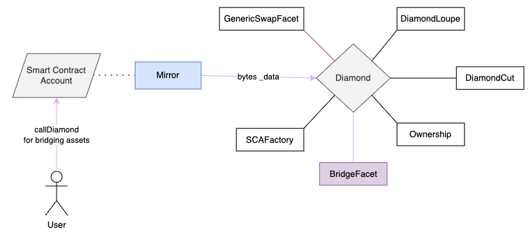

### **Fungi Protocol: Scalable and Modular DeFi Aggregator**

Fungi Protocol is a dynamic, modular, and scalable DeFi aggregator built upon the diamond standard (ERC-2535). Stemming from the challenges posed by the rapid expansion of the DeFi sector and the need for standardization, Fungi Protocol proposes a solution to foster structured and unified DeFi development and adoption.

#### **Core Concept**:

Fungi Protocol relies on the concept of a "diamond" and its facets. These facets are modular chunks of functionality that can be attached to or replaced in the diamond, making the protocol adaptable, upgradable, and suited to the fast-evolving DeFi landscape. The facets are meant to be used by external contracts that desire to overcome the contract size limit set on EIP-170. The protocol will offer tools to easily add new facets to the diamond with minimal effort and without the need to redeploy the entire diamond. We expect that the community will develop a wide range of facets that will be used to build a variety of DeFi products and combining them in different ways to create new products on top of the DeFi primitives, following a rigurous and efficient auditing process.



As shown in the figure above, the diamond is the core contract that holds the data and the logic of the protocol, one can think of the diamond as a router that receives some instructions from an external contract or EOA and then it redirects to the right facet. For example, if a user wants to swap some assets, the diamond will redirect the call to the GenericSwapFacet, which will execute the swap; or perhaps the user wants to bridge some assets to another chain, then the diamond will redirect the call to the BridgeFacet, which will execute the bridge.

#### **Diamond Standard**:
The diamond is composed of facets, which are contracts that contain a specific set of functions. The diamond is the only contract that can be called directly by users. The diamond delegates the calls to the facets, which are called internally. The diamond can be upgraded by adding new facets or replacing existing ones.

The question is how can the diamond know which facet to call? The answer is that the diamond uses a function selector to identify the function that the user wants to call, and then it uses a mapping to identify the facet that contains the function. The mapping is called `functionSelectors` and it maps the function selector to the facet that contains the function. The diamond uses the `functionSelectors` mapping to identify the facet that contains the function that the user wants to call. This whole information is passed to the diamond in the form of a bytes stream, which is less straightforward to implement, but it gives us a lot of flexibility. However, each call to the diamond's facets will require a different bytes stream, which makes it difficult to interact with the diamond directly.



#### **SmartContractAccount**:

To overcome this issue, we have created a SmartContractAccount contract (or wallet) and a GUI that allows users to interact with the diamond in a more user-friendly way using a wallet as a proxy, abstracting the creation of the bytes stream. 



The SmartContractAccount contract is a contract that can receive and send assets such as ERC20 tokens and NFTs. It inherits from an abstract contract called "Mirror" which holds part of the logic to interact with the diamond. It sort of mirrors the functionality of the chosen facet and allows the SmartContractAccount to use it as its own.




### **Deployment Process and Interaction with SFS**

This repo provides the scripts for deploying the diamond and the facets to the Mode network. The deployment process is as follows:

Diamond (Protocol) Deployment:
1. The Protocol DAO will register to the SFS contract and get the NFT tokenId.
2. The facets are deployed independently to the selected network, here the SCAFactory facet is deployed with the tokenId obtained in the previews step.
3. The diamond is deployed to the Mode network.
4. The diamond is initialized with the addresses of the facets.

SmartContractAccount (Wallet) Deployment:
1. The SCAFactory facet is called to deploy a new SmartContractAccount.
2. The created SCA is registered to the SFS contract with the NFT of the Protocol DAO, so all newly created SCAs will be under the same SFS registry.

This way, all the activity of the SCAs and calls to the diamond fall on the same SFS registry, which will allow the Protocol DAO to claim the fees.

### Repository Structure<a name="repository-structure"></a>

```
contracts
│ README.md                   // you are here
│ ...                         // setup and development configuration files
│
├─── script                   // deploy scripts
│
├─── src                      // the contract code
│   ├── app                   // application facets such as the ones for swapping and bridging
│   ├── core                  // Diamond contract with the basic facets: DiamondCut, DiamondLoupe, Ownership
│   ├── Errors                // error definitions
│   ├── SmartContractAccount  // fund contract
│   ├── libraries             // libraries for updating the diamond storage
|   └── mirror                // diamond mirror contract
│
├─── test                     // contract unit tests
│   ├─── facets               // facet tests
│   ├─── SmartContractAccount // fund tests
│   └─── utils                // testing utility functions
│
├───Makefile                  // makefile for running tests, deploying contracts, running test nodes and installing dependencies
└───.env.example              // example .env file

```

GitHub Copilot: # Project Setup and Deployment Instructions

This project uses a Makefile to manage common tasks such as installation, building, testing, and deployment. Here's a brief explanation of each command:

## Installation
To install the project dependencies, run the following command:

```bash
make install
```

This command will install the necessary Foundry packages and other dependencies.

## Building

To compile the project, use the following command:

```bash
make build
```

This command will compile the smart contracts using the Foundry build system.

## Testing

To run the tests, use the following command:

```bash
make test
```

This command will execute the project's test suite.

## Deployment

The project can be deployed to various networks. The network is specified using the `ARGS` variable with the `--network` option. For example, to deploy to the Sepolia Mode network, use the following command:

```bash
make deploy ARGS="--network modetestnet"
```

The deployment script will modify the `deployerPK` and `DiamondOwner` in the `DeployDiamond.s.sol` script to deploy the diamond in the network of your choice.

## Running a Node

To run a node, use the following command:

```bash
make node
```

This command will start an Anvil node.

Please note that you need to have a `.env` file in the project root with the necessary environment variables set (e.g., `SEPOLIA_RPC_URL`, `SEPOLIA_PRIVATE_KEY`, `ETHERSCAN_API_KEY`, etc.) for the deployment and other network-related commands to work correctly.
